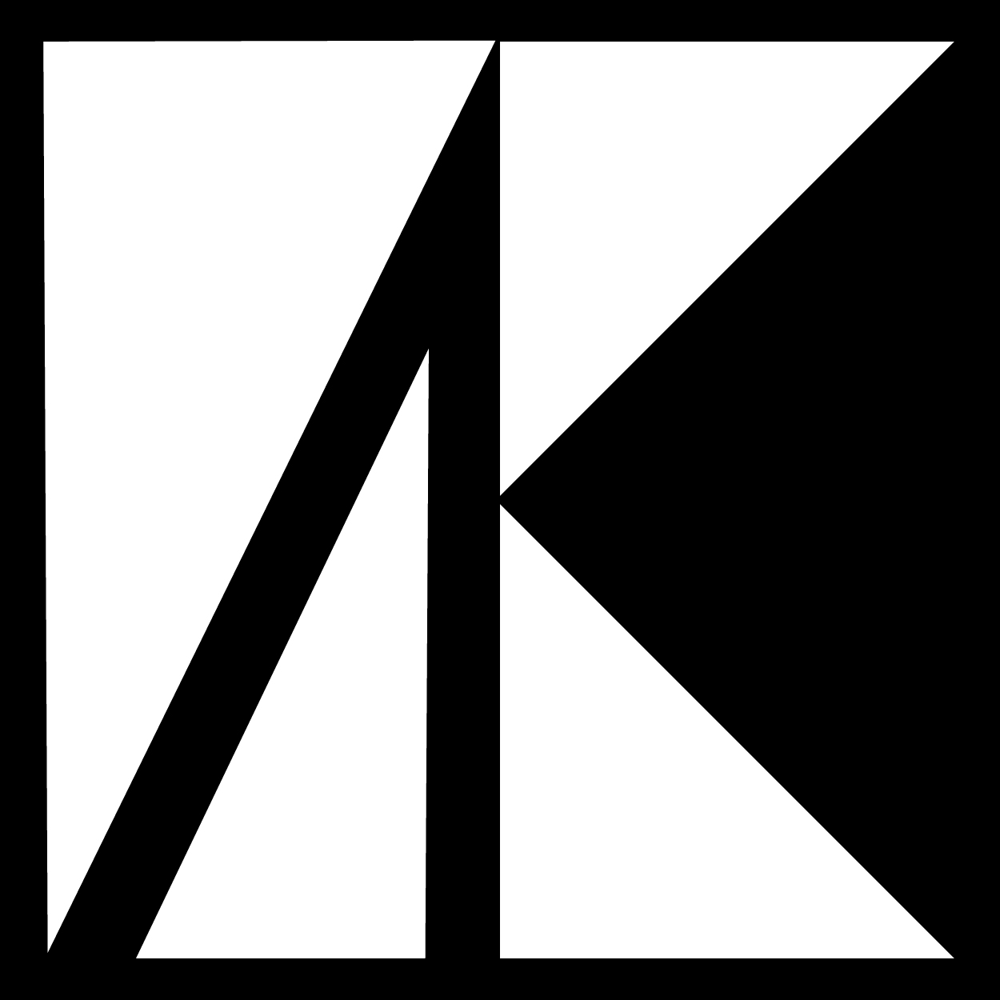

<div align="center">
  

# RepositoryKit

Modern repository pattern implementation for .NET with EntityFramework and MongoDB support


</div>

## 📦 Packages

| Package                                                                                       | Version                                                                | Downloads                                                               |
| --------------------------------------------------------------------------------------------- | ---------------------------------------------------------------------- | ----------------------------------------------------------------------- |
| [RepositoryKit.Core](https://www.nuget.org/packages/RepositoryKit.Core)                       |             |             |
| [RepositoryKit.EntityFramework](https://www.nuget.org/packages/RepositoryKit.EntityFramework) |  |  |
| [RepositoryKit.MongoDB](https://www.nuget.org/packages/RepositoryKit.MongoDB)                 |          |          |
| [RepositoryKit.Extensions](https://www.nuget.org/packages/RepositoryKit.Extensions)           |       |       |

## ✨ Features

✔ Generic repository pattern implementation  
✔ Unit of Work support  
✔ Async operations  
✔ EntityFramework Core integration  
✔ MongoDB integration  
✔ Paging and sorting extensions  
✔ Clean architecture friendly

## 🚀 Quick Start

### Installation

```bash
# For EntityFramework
dotnet add package RepositoryKit.EntityFramework

# For MongoDB
dotnet add package RepositoryKit.MongoDB

# Just core interfaces
dotnet add package RepositoryKit.Core
```

## Configuration

```csharp
// For EntityFramework
services.AddRepositoryKitWithEntityFramework<YourDbContext>();

// For MongoDB
services.AddRepositoryKitWithMongoDB("mongodb://localhost:27017", "YourDatabaseName");
```

## 💻 Usage Example

```csharp
public class ProductService
{
    private readonly IUnitOfWork _unitOfWork;

    public ProductService(IUnitOfWork unitOfWork)
    {
        _unitOfWork = unitOfWork;
    }

    public async Task AddProduct(Product product)
    {
        var repository = _unitOfWork.GetRepository<Product, int>();
        await repository.AddAsync(product);
        await _unitOfWork.CommitAsync();
    }

    public async Task<List<Product>> GetProducts(int page, int pageSize)
    {
        var repository = _unitOfWork.GetRepository<Product, int>();
        return await repository.GetPagedAsync(page, pageSize);
    }
}
```

## 🤝 Contributing

Pull requests are welcome! For major changes, please open an issue first.

1. Fork the project
2. Create your feature branch (git checkout -b feature/AmazingFeature)
3. Commit your changes (git commit -m 'Add some amazing feature')
4. Push to the branch (git push origin feature/AmazingFeature)
5. Open a pull request

## 📜 License

Distributed under the MIT License. See `LICENSE` for more information.

<div align="center"> <sub>Built with ❤️ by <a href="https://github.com/taberkkaya">taberkkaya</a></sub> </div>
